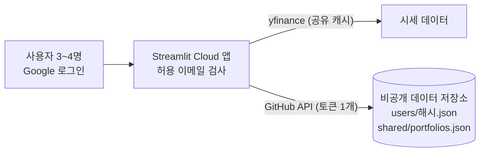

# 3~4명이 함께 쓰기 위한 방안

작성일: 2026-09-20

## 결론

3~4명 규모라면 **DB로 가지 않고 현재 구조(GitHub JSON 저장)를 확장**하는 것을 권장한다. 필요한 변경은 세 가지다.

1. **데이터 저장소를 비공개 저장소로 분리** — 지금 코드 저장소(`quant_portfolio`)는 공개(public)라서, 같은 저장소에 저장하면 누구나 읽을 수 있다.
2. **앱 안에서 Google 로그인(`st.login`) + 허용 이메일 목록**으로 접근을 통제하고 사용자를 식별한다.
3. **사용자별 JSON 파일**(`users/<해시>.json`)로 저장해 서로의 데이터가 섞이거나 덮어쓰이지 않게 한다.

이 구조는 저장 빈도가 낮은 소규모 그룹에 적합하다. 사용자가 크게 늘거나 동시 편집·검색이 필요해지면 관리형 DB(Supabase 등)로 옮기고, 저장 계층을 `portfolio_store.py`에 모아두었기 때문에 교체 범위는 그 파일에 한정된다.

## 먼저 정해야 할 것

아래 세 가지에 따라 구현 범위가 달라진다. 지금은 가정을 두고 설계했으니 다르면 알려달라.

| 질문 | 가정 | 다르면 |
| --- | --- | --- |
| 서로의 포트폴리오를 볼 수 있어야 하나? | 기본은 **각자 비공개**, 공유용 파일을 따로 둠 | 모두 공유해도 되면 현재의 단일 파일 + 비공개 저장소만으로 충분 (사용자 분리 작업 불필요) |
| 실제 보유 수량도 저장하나? | 예, 리밸런싱 가이드용으로 **사용자별 저장** | 저장하지 않으면 매번 입력 |
| 4명 모두 Google 계정이 있나? | 있음 | 없으면 다른 OIDC 공급자(Microsoft 등) 또는 Community Cloud의 이메일 링크 로그인 검토 |

## 현재 상태와 문제점

- 저장은 GitHub의 JSON 파일 하나(`data/portfolios.json`)이고, 사용자 개념이 없다. 앱 주소를 아는 사람은 누구나 열 수 있다.
- **코드 저장소가 공개**다. 그래서 (1) 저장 데이터를 같은 저장소에 두면 공개되고, (2) `app_advanced.py` 탭3의 기본 보유 수량(실제 보유 수량)이 이미 공개 저장소의 코드와 커밋 이력에 들어 있다. 코드에서 지워도 이력에는 남는다.
- 시세는 `yfinance`로 세션마다 받는다. 사용자가 늘면 요청이 늘어나 Yahoo의 요청 제한(429)에 걸릴 위험이 있다(이 조사에서 Cloud 환경의 한도를 직접 확인하지는 못했다).

## 접근 통제 옵션

| 방식 | 사용자 식별 | 설정 난이도 | 비고 |
| --- | --- | --- | --- |
| **`st.login` (OIDC) + 허용 이메일 목록** (권장) | 가능 (`st.user.email`) | 중간: Google OAuth 클라이언트 생성, secrets 설정 | 공급자는 Google, Microsoft, Okta 등 OIDC면 무엇이든 가능. 로그인 쿠키는 앱을 닫아도 30일 유지 ([공식 문서](https://docs.streamlit.io/develop/api-reference/user/st.login)) |
| Community Cloud 비공개 앱 + 뷰어 이메일 허용 목록 | 앱 코드에서 식별 가능한지는 이번 조사에서 확인하지 못함 | 낮음: 앱 설정에서 이메일만 추가 | Google 계정이면 Google 로그인, 아니면 1회용 이메일 링크. 비공개 앱은 계정당 1개 제한 ([공유 문서](https://docs.streamlit.io/deploy/streamlit-community-cloud/share-your-app)) |
| 공용 비밀번호(secrets) | 불가 | 낮음 | 누가 저장했는지 구분이 안 되어 비권장 |

사용자별 데이터를 분리하려면 앱이 "누구인지" 알아야 하므로 `st.login`이 필요하다. Cloud의 뷰어 허용 목록은 그 위에 얹는 이중 방어로 선택 사항이다. 현재 `requirements.txt`에 고정된 Streamlit 1.52.2에서 `st.login`을 쓸 수 있다.

## 데이터 저장 옵션

| 방식 | 동시 저장 충돌 | 사용자 분리 | 비용 | 적합한 규모 |
| --- | --- | --- | --- | --- |
| A. 단일 공용 JSON (현재) | 있음(재시도로 방어) | 없음 | 무료 | 서로 다 보여도 되는 소규모 |
| **B. 사용자별 JSON 파일** (권장) | 사실상 없음 | 파일 단위 | 무료 | 소규모 그룹 |
| C. Google Sheets | 낮음 | 시트/탭 단위 | 무료 | 사람이 표로 직접 편집해야 할 때 ([연결 문서](https://docs.streamlit.io/develop/tutorials/databases/private-gsheet)) |
| D. 관리형 DB (Supabase 등) | 트랜잭션으로 해결 | 행 단위 | 무료 플랜: DB 500MB, 1주일 활동이 없으면 프로젝트 일시 중지 ([요금 정리](https://uibakery.io/blog/supabase-pricing)) | 10명 이상, 검색·감사 로그가 필요할 때 |

B가 3~4명에게 가장 단순하다. 각자 자기 파일에만 쓰므로 GitHub의 sha 충돌(같은 파일을 동시에 수정할 때 발생하는 409, [사례](https://github.com/orgs/community/discussions/62198))이 거의 생기지 않는다. 충돌이 나도 이미 구현된 재시도가 처리한다.

## 권장 구조



데이터 저장소 구성 예:

```
quant_portfolio_data/            (비공개 저장소)
├── users/
│   ├── 3f9a1c0b7d2e.json        # 사용자별: 포트폴리오 + 보유 수량
│   └── ...
└── shared/
    └── portfolios.json          # 함께 보려고 공유한 포트폴리오
```

- 파일명은 이메일의 SHA-256 앞 12자리로 만들어 저장소에 이메일이 그대로 드러나지 않게 한다.
- 앱이 쓰는 GitHub 토큰은 서버에만 있고 사용자는 볼 수 없다. 다만 토큰 하나로 모든 사용자 파일에 접근할 수 있으므로, 사용자 간 분리는 **앱 로직 수준의 분리**다. 서로 신뢰하는 소규모 그룹에는 충분하지만, 적대적인 사용자를 가정한 멀티테넌시는 아니다.
- 데이터 저장소가 코드 저장소와 분리되면 데이터를 커밋해도 앱이 재배포되지 않는다. 그래서 별도 `data` 브랜치도 필요 없어지지만, 현재 코드는 브랜치를 자동 생성해 쓰므로 그대로 둬도 동작한다.

## 구현 스케치

secrets (TOML은 최상위 키가 테이블(`[auth]`)보다 앞에 와야 한다):

```toml
GITHUB_TOKEN = "github_pat_..."                        # 데이터 저장소에만 Contents: Read and write
GITHUB_REPO = "leenamkee/quant_portfolio_data"
ALLOWED_EMAILS = ["a@gmail.com", "b@gmail.com", "c@gmail.com", "d@gmail.com"]

[auth]
redirect_uri = "https://<앱 주소>/oauth2callback"
cookie_secret = "<충분히 긴 랜덤 문자열>"

[auth.google]
client_id = "..."
client_secret = "..."
server_metadata_url = "https://accounts.google.com/.well-known/openid-configuration"
```

로그인 게이트와 사용자 키 (앱 상단):

```python
import hashlib

def require_user():
    if not st.user.is_logged_in:
        st.title("퀀트 포트폴리오 매니저")
        st.button("Google로 로그인", on_click=st.login, args=["google"])
        st.stop()
    email = st.user.email.lower()
    if email not in st.secrets["ALLOWED_EMAILS"]:
        st.error("접근 권한이 없는 계정입니다.")
        st.button("로그아웃", on_click=st.logout)
        st.stop()
    return email

def user_key(email):
    return hashlib.sha256(email.encode()).hexdigest()[:12]
```

저장 계층 변경 (`portfolio_store.py`): `GitHubBackend`가 이미 `path`를 인자로 받으므로 `get_backend(secrets, user_key)`가 `users/{user_key}.json`(개인)과 `shared/portfolios.json`(공유) 두 백엔드를 만들어 돌려주도록 확장하면 된다. 탭2 "현재 구성 저장" 옆에 "공유" 선택을 두고, 탭4는 "내 포트폴리오 + 공유 포트폴리오"를 함께 보여준다.

## 단계별 로드맵

| 단계 | 내용 | 상태 |
| --- | --- | --- |
| 0. 1인 사용 | GitHub JSON 저장, 포트폴리오 비교, JSON 백업/복원 | 완료 |
| 1. 3~4명 | 비공개 데이터 저장소 생성 → 토큰/secrets 교체 → `st.login` + 허용 이메일 → 사용자별 파일 → 보유 수량을 코드 기본값에서 사용자 저장소로 이동 → 시세 캐시 확대 | 이 문서의 대상 |
| 2. 확장 | 사용자 10명 이상, 잦은 저장, 동시 편집, 감사 로그, 검색이 필요해지면 Supabase/Firestore로 저장 계층 교체 | 필요할 때 |

단계 1 체크리스트:

- [ ] 비공개 저장소 `quant_portfolio_data` 생성 (README 등 첫 커밋 1개)
- [ ] fine-grained 토큰을 그 저장소 하나에만 Contents 읽기/쓰기로 발급 (만료일을 정하고 갱신 일정 기록)
- [ ] Google Cloud에서 OAuth 클라이언트 생성, 리디렉션 URI에 앱 주소 등록
- [ ] Cloud Secrets에 위 설정 입력
- [ ] 로그인 게이트, 사용자별 백엔드, 공유 선택 UI 구현
- [ ] 탭3 기본 보유 수량 제거 → 사용자별 보유 수량 저장/불러오기
- [ ] `yfinance` 호출을 `st.cache_data`로 감싸 사용자 간에 시세를 공유(탭4는 이미 적용, 탭1~3은 미적용)

## 리스크와 대응

| 리스크 | 대응 |
| --- | --- |
| 공개 저장소의 커밋 이력에 실제 보유 수량이 남아 있음 | 코드에서 제거해도 이력은 남는다. 민감하면 이력 정리(force push)나 저장소 재생성을 검토하되, 되돌릴 수 없는 작업이라 별도로 결정한다. |
| Yahoo 요청 제한(429) | 시세 캐시 공유, 캐시 시간 조정. 지속되면 가격 스냅샷을 데이터 저장소에 저장하는 방식 검토 |
| 토큰 만료로 저장 실패 | 앱이 오류를 화면에 표시한다. 만료일을 기록해 미리 갱신 |
| 토큰 유출 | 데이터 저장소 하나에만 권한을 주고, 코드/로그에 출력하지 않으며 `st.secrets`로만 사용 |
| 사용자 간 분리가 앱 로직에 의존 | 서로 신뢰하는 소규모 그룹 전제. 더 엄격한 분리가 필요하면 단계 2(DB의 행 단위 권한)로 |

## 참고 자료

- [st.login – Streamlit 공식 문서](https://docs.streamlit.io/develop/api-reference/user/st.login)
- [User authentication and information – Streamlit 공식 문서](https://docs.streamlit.io/develop/concepts/connections/authentication)
- [Share your app – Streamlit 공식 문서](https://docs.streamlit.io/deploy/streamlit-community-cloud/share-your-app)
- [Manage your app – Streamlit 공식 문서](https://docs.streamlit.io/deploy/streamlit-community-cloud/manage-your-app)
- [Connect Streamlit to a private Google Sheet – Streamlit 공식 문서](https://docs.streamlit.io/develop/tutorials/databases/private-gsheet)
- [Error 409 Conflict with "Create or Update File Contents" REST API – GitHub Discussions](https://github.com/orgs/community/discussions/62198)
- [Supabase Pricing in 2026 – UI Bakery](https://uibakery.io/blog/supabase-pricing)
- 저장소 공개 여부: GitHub API로 확인 (2026-09-20 기준 `visibility: public`)
