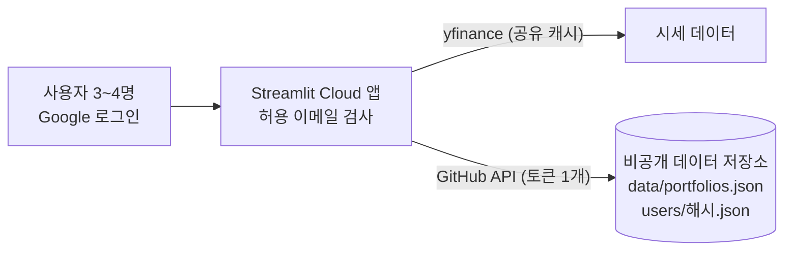

# 3~4명이 함께 쓰기 위한 방안

작성일: 2026-09-20

## 결론

> 2026-09-21: 아래 권장안 중 로그인·공용 포트폴리오·사용자별 보유 수량을 구현했다. 남은 것은 배포 설정이다([설정 가이드](google-login-setup.md)).

3~4명 규모라면 **DB로 가지 않고 현재 구조(GitHub JSON 저장)를 확장**하는 것을 권장한다. 필요한 변경은 세 가지다.

1. **데이터 저장소를 비공개 저장소로 분리** — 지금 코드 저장소(`quant_portfolio`)는 공개(public)라서, 같은 저장소에 저장하면 누구나 읽을 수 있다.
2. **앱 안에서 Google 로그인(`st.login`) + 허용 이메일 목록**으로 접근을 통제하고 사용자를 식별한다.
3. **사용자별 JSON 파일**(`users/<해시>.json`)로 저장해 서로의 데이터가 섞이거나 덮어쓰이지 않게 한다.

이 구조는 저장 빈도가 낮은 소규모 그룹에 적합하다. 사용자가 크게 늘거나 동시 편집·검색이 필요해지면 관리형 DB(Supabase 등)로 옮기고, 저장 계층을 `portfolio_store.py`에 모아두었기 때문에 교체 범위는 그 파일에 한정된다.

## 먼저 정해야 할 것

2026-09-21에 아래와 같이 확정했고, 이 결정대로 구현했다.

| 질문 | 결정 | 구현 |
| --- | --- | --- |
| 서로의 포트폴리오를 볼 수 있어야 하나? | **예, 모두가 서로 볼 수 있다** | 하나의 공용 파일(`data/portfolios.json`)에 저장하고 작성자를 표시. 수정·삭제는 작성자 본인만 |
| 실제 보유 수량도 저장하나? | **예, 사용자별로 저장** | 사용자별 파일(`users/<해시>.json`), 본인만 조회. 코드에 있던 실제 보유 수량 기본값은 제거 |
| 로그인 방식 | **4명 모두 Google 계정이 있다 → Google 로그인 연동** | `st.login` + `ALLOWED_EMAILS` 허용 목록 ([설정 가이드](google-login-setup.md)) |

## 구현 전 상태와 문제점 (2026-09-20 기준)

- 저장은 GitHub의 JSON 파일 하나(`data/portfolios.json`)이고, 사용자 개념이 없다. 앱 주소를 아는 사람은 누구나 열 수 있다.
- **코드 저장소가 공개**다. 그래서 (1) 저장 데이터를 같은 저장소에 두면 공개되고, (2) `app_advanced.py` 탭3의 기본 보유 수량(실제 보유 수량)이 공개 저장소의 코드와 커밋 이력에 들어 있었다(코드에서는 2026-09-21에 제거, 이력에는 남음).
- 시세는 `yfinance`로 세션마다 받는다. 사용자가 늘면 요청이 늘어나 Yahoo의 요청 제한(429)에 걸릴 위험이 있다(이 조사에서 Cloud 환경의 한도를 직접 확인하지는 못했다).

## 접근 통제 옵션

| 방식 | 사용자 식별 | 설정 난이도 | 비고 |
| --- | --- | --- | --- |
| **`st.login` (OIDC) + 허용 이메일 목록** (권장) | 가능 (`st.user.email`) | 중간: Google OAuth 클라이언트 생성, secrets 설정 | 공급자는 Google, Microsoft, Okta 등 OIDC면 무엇이든 가능. 로그인 쿠키는 앱을 닫아도 30일 유지 ([공식 문서](https://docs.streamlit.io/develop/api-reference/user/st.login)) |
| Community Cloud 비공개 앱 + 뷰어 이메일 허용 목록 | 앱 코드에서 식별 가능한지는 이번 조사에서 확인하지 못함 | 낮음: 앱 설정에서 이메일만 추가 | Google 계정이면 Google 로그인, 아니면 1회용 이메일 링크. 비공개 앱은 계정당 1개 제한 ([공유 문서](https://docs.streamlit.io/deploy/streamlit-community-cloud/share-your-app)) |
| 공용 비밀번호(secrets) | 불가 | 낮음 | 누가 저장했는지 구분이 안 되어 비권장 |

사용자별 데이터를 분리하려면 앱이 "누구인지" 알아야 하므로 `st.login`이 필요하다. Cloud의 뷰어 허용 목록은 그 위에 얹는 이중 방어로 선택 사항이다. `st.login`은 Streamlit 1.42.0부터 제공되며 Authlib가 필요하다. 그래서 `requirements.txt`의 `streamlit==1.52.2`를 `streamlit[auth]==1.52.2`로 바꿨다(Authlib 자동 설치를 확인).

## 데이터 저장 옵션

| 방식 | 동시 저장 충돌 | 사용자 분리 | 비용 | 적합한 규모 |
| --- | --- | --- | --- | --- |
| A. 단일 공용 JSON | 있음(재시도로 방어) | 없음 | 무료 | 서로 다 보여도 되는 데이터 — **포트폴리오에 사용** |
| **B. 사용자별 JSON 파일** | 사실상 없음 | 파일 단위 | 무료 | 본인만 봐야 하는 데이터 — **보유 수량에 사용** |
| C. Google Sheets | 낮음 | 시트/탭 단위 | 무료 | 사람이 표로 직접 편집해야 할 때 ([연결 문서](https://docs.streamlit.io/develop/tutorials/databases/private-gsheet)) |
| D. 관리형 DB (Supabase 등) | 트랜잭션으로 해결 | 행 단위 | 무료 플랜: DB 500MB, 1주일 활동이 없으면 프로젝트 일시 중지 ([요금 정리](https://uibakery.io/blog/supabase-pricing)) | 10명 이상, 검색·감사 로그가 필요할 때 |

결정 사항에 맞춰 공유해도 되는 포트폴리오는 A, 본인만 봐야 하는 보유 수량은 B로 나눠 쓴다. B는 각자 자기 파일에만 쓰므로 GitHub의 sha 충돌(같은 파일을 동시에 수정할 때 발생하는 409, [사례](https://github.com/orgs/community/discussions/62198))이 거의 생기지 않는다. 충돌이 나도 이미 구현된 재시도가 처리한다.

## 권장 구조



데이터 저장소 구성:

```
quant_portfolio_data/            (비공개 저장소, 앱이 data 브랜치를 자동 생성)
├── data/
│   └── portfolios.json          # 모두가 볼 수 있는 포트폴리오 (owner_key, owner_name 포함)
└── users/
    ├── 3f9a1c0b7d2e.json        # 사용자별: 보유 수량 (본인만 조회)
    └── ...
```

- 파일명은 이메일의 SHA-256 앞 12자리로 만들어 저장소에 이메일이 그대로 드러나지 않게 한다.
- 앱이 쓰는 GitHub 토큰은 서버에만 있고 사용자는 볼 수 없다. 다만 토큰 하나로 모든 파일에 접근할 수 있으므로, 사용자 간 분리(보유 수량 비공개, 작성자만 수정)는 **앱 로직 수준의 분리**다. 서로 신뢰하는 소규모 그룹에는 충분하지만, 적대적인 사용자를 가정한 멀티테넌시는 아니다.
- 데이터 저장소가 코드 저장소와 분리되면 데이터를 커밋해도 앱이 재배포되지 않는다. 별도 `data` 브랜치는 코드가 자동으로 만들어 쓰며 그대로 두어도 무방하다.
- 공용 포트폴리오 파일은 여러 사용자가 동시에 저장하면 충돌할 수 있지만, 저장 시 최신본을 다시 읽어 재시도하므로 소규모에서는 문제가 되지 않는다.

## 구현 스케치

구현 위치:

| 파일 | 역할 |
| --- | --- |
| `auth.py` | `resolve_identity()`: 로그인 상태·허용 이메일·`email_verified`를 판정하고 사용자 키(이메일 해시)를 만든다. 로그인 설정 없이 GitHub 저장소만 설정된 경우는 데이터 보호를 위해 앱을 열지 않는다(fail-closed). |
| `portfolio_store.py` | 작성자 기반 수정/삭제 제한(`can_modify`), 사용자별 보유 수량 저장(`load_holdings`/`save_holdings`), 경로별 백엔드(`get_backend(secrets, path)`) |
| `app_advanced.py` | 로그인 게이트, 사이드바 사용자 표시·로그아웃, 탭2 저장 시 작성자 기록, 탭3 보유 수량 저장/자동 불러오기, 탭4 작성자 표시와 본인 것만 삭제 |

Secrets 설정은 [google-login-setup.md](google-login-setup.md)를 따른다. TOML에서는 최상위 키(`GITHUB_*`, `ALLOWED_EMAILS`)가 `[auth]` 테이블보다 앞에 와야 한다.

`st.user`에서 쓰는 값은 `is_logged_in`, `email`, `name`, `email_verified`이며 Google의 ID 토큰 클레임이다. 로그인 설정이 없으면 `st.user`에는 속성이 없다. Streamlit은 ID 토큰의 만료 시각을 자동으로 검사하지 않고, 로그인 쿠키는 앱을 닫아도 30일 유지된다([공식 문서](https://docs.streamlit.io/develop/api-reference/user/st.login)). 허용 목록에서 사용자를 뺀 경우에는 그 사용자가 다음 요청부터 바로 거부된다(매 실행마다 허용 목록을 검사한다).

## 단계별 로드맵

| 단계 | 내용 | 상태 |
| --- | --- | --- |
| 0. 1인 사용 | GitHub JSON 저장, 포트폴리오 비교, JSON 백업/복원 | 완료 |
| 1. 3~4명 | Google 로그인 + 허용 이메일, 공용 포트폴리오(작성자 표시), 사용자별 보유 수량 | **코드 구현 완료, 아래 배포 작업 필요** |
| 2. 확장 | 사용자 10명 이상, 잦은 저장, 동시 편집, 감사 로그, 검색이 필요해지면 Supabase/Firestore로 저장 계층 교체 | 필요할 때 |

단계 1 배포 체크리스트 ([설정 가이드](google-login-setup.md)):

- [ ] 비공개 저장소 `quant_portfolio_data` 생성 (README 등 첫 커밋 1개)
- [ ] fine-grained 토큰을 그 저장소 하나에만 Contents 읽기/쓰기로 발급 (만료일 기록)
- [ ] Google Cloud에서 OAuth 클라이언트 생성, 동의 화면의 테스트 사용자에 4명 추가, 리디렉션 URI 등록
- [ ] Cloud Secrets에 `GITHUB_*`, `ALLOWED_EMAILS`, `[auth]` 입력
- [ ] 4명이 각각 로그인해 보유 수량 저장, 서로의 포트폴리오가 보이는지 확인
- [ ] (남은 개발) `yfinance` 호출을 `st.cache_data`로 감싸 사용자 간에 시세 공유 — 탭4만 적용됨, 탭1~3은 미적용

## 리스크와 대응

| 리스크 | 대응 |
| --- | --- |
| 공개 저장소의 커밋 이력에 실제 보유 수량이 남아 있음 | 코드의 기본값은 제거했지만 이력은 남는다. 민감하면 이력 정리(force push)나 저장소 재생성을 검토하되, 되돌릴 수 없는 작업이라 별도로 결정한다. |
| Yahoo 요청 제한(429) | 시세 캐시 공유, 캐시 시간 조정. 지속되면 가격 스냅샷을 데이터 저장소에 저장하는 방식 검토 |
| 토큰 만료로 저장 실패 | 앱이 오류를 화면에 표시한다. 만료일을 기록해 미리 갱신 |
| 토큰 유출 | 데이터 저장소 하나에만 권한을 주고, 코드/로그에 출력하지 않으며 `st.secrets`로만 사용 |
| 사용자 간 분리가 앱 로직에 의존 | 서로 신뢰하는 소규모 그룹 전제. 더 엄격한 분리가 필요하면 단계 2(DB의 행 단위 권한)로 |
| Google 테스트 모드의 "확인되지 않은 앱" 안내 화면 | 4명 규모에서는 그대로 사용 가능. 사용자가 늘면 앱 게시(프로덕션) 전환 검토 |

## 참고 자료

- [st.login – Streamlit 공식 문서](https://docs.streamlit.io/develop/api-reference/user/st.login)
- [User authentication and information – Streamlit 공식 문서](https://docs.streamlit.io/develop/concepts/connections/authentication)
- [Share your app – Streamlit 공식 문서](https://docs.streamlit.io/deploy/streamlit-community-cloud/share-your-app)
- [Manage your app – Streamlit 공식 문서](https://docs.streamlit.io/deploy/streamlit-community-cloud/manage-your-app)
- [Connect Streamlit to a private Google Sheet – Streamlit 공식 문서](https://docs.streamlit.io/develop/tutorials/databases/private-gsheet)
- [Error 409 Conflict with "Create or Update File Contents" REST API – GitHub Discussions](https://github.com/orgs/community/discussions/62198)
- [Supabase Pricing in 2026 – UI Bakery](https://uibakery.io/blog/supabase-pricing)
- 저장소 공개 여부: GitHub API로 확인 (2026-09-20 기준 `visibility: public`)
