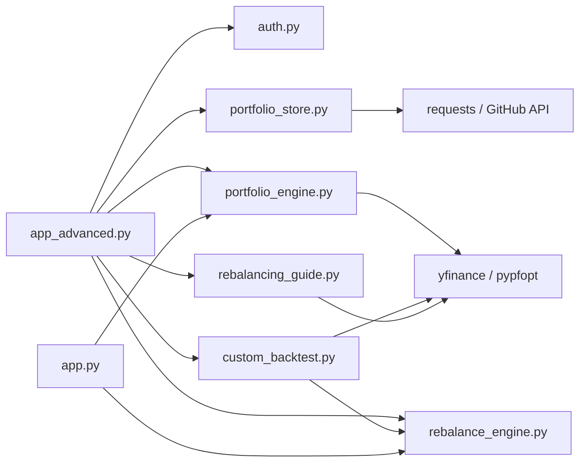

# 리팩토링 계획서

작성일: 2026-09-22 · 개정: 2026-09-22 (검토 의견 [refactoring-plan-review.md](refactoring-plan-review.md) 반영) · 기준 커밋: `a937fe8` · 결정 사항 확정: 2026-09-22(§9) · 이 문서는 코드 검토 결과와 계획만 담고, 코드는 수정하지 않았다.

## 요약

- **현황**: Python 8개 파일, **1,440줄**(빈 줄 포함, `wc -l` 기준. 빈 줄 제외 시 1,189줄). 이 중 `app_advanced.py`(615줄, 빈 줄 제외 515줄)가 화면 4개 탭, 세션 상태, 데이터 조회, 차트 렌더링을 모두 한 파일의 최상위 코드로 갖고 있다. 자동 테스트와 CI는 없다.
- **판단**: 정상 경로는 동작하지만, **실패·경계 경로에서 조용히 잘못된 결과를 내는 곳이 있다**(가격이 누락된 보유 종목을 0원으로 계산해 다른 종목을 잘못 매도하라고 안내, 결측 처리가 pandas 버전에 따라 달라짐 등). 그 위에 구조 문제(모놀리스, 차트 코드 3중 복제)가 쌓여 있다.
- **권장 순서** (검토 의견 반영으로 재배치): ① 안전망(테스트, CI) → ② 입력 검증과 실패 은닉 제거 → ③ 데이터 계약(설정·시세 조회·결측 정책) → ④ 정확성 PR(첫 거래일 누락) → ⑤ 저장 계층 안정화 → ⑥ UI 분해와 위생 정리. 각 단계는 독립 PR이고, 구조만 옮기는 PR은 동작을 바꾸지 않는다.
- **가장 먼저 할 5가지**: (1) 테스트 도입, 경계값·실패 경로 포함 (2) 가격 조회 실패 은닉 제거(A5)와 엔진 입력 검증(A8) (3) 시세 조회 단일화와 결측·정렬 정책 명시(A2, D1) (4) 성과 지표의 첫 거래일 누락 수정(A1) (5) 저장소 읽기 검증·마이그레이션과 브랜치 생성 경쟁 처리(E2, E6).
- **결정 사항 9개는 2026-09-22에 권장안대로 확정**했다(§9). 2026-09-22에 단계 0~4를 실행했다(진행 현황 참고).
- 노출된 자격 증명의 재발급은 사용자가 별도로 진행한다(§0). 이 계획의 착수 조건이 아니다.

## 진행 현황

| 단계 | 상태 | 결과 |
| --- | --- | --- |
| 0. 안전망 | **완료** (2026-09-22, `d48787b`) | 93개 통과 + 18개 기대 실패, CI(Linux, Python 3.11, 고정 버전) 통과 |
| 1. 결함 수정 | **완료** (2026-09-22) | 181개 통과 + 6개 기대 실패(후속 단계 대상). A5, A6, A8 해소. 릴리스 노트: [release-notes.md](release-notes.md) |
| 2. 설정·데이터 계약 | **완료** (2026-09-22) | 207개 통과 + 5개 기대 실패. 같은 테스트가 pandas 2.3.3과 3.0.6에서 같은 결과. A2, D1, C1, C2, B8, B3 일부 해소. 릴리스 노트 있음 |
| 3. 정확성 PR | **완료** (2026-09-22) | 211개 통과 + 3개 기대 실패(E2 2건, E6: 단계 4 대상). A1, A3 해소. 릴리스 노트 있음 |
| 4. 저장소 안정화 | **완료** (2026-09-22) | 221개 통과, 기대 실패 0(모든 xfail 해소). E2, E6, E1 해소. E3·E4는 조사만 하고 코드는 바꾸지 않음(아래 참고) |
| 5. UI 분해와 위생 | **완료** (2026-09-22) | 220개 통과. `app_advanced.py` 615줄 → 79줄(+ `ui/` 패키지). B1~B9, F2, I 해소. G1(부분)·G2·G3·G4·G5(부분)·F4 처리, §9-1(app.py 폐기)·§9-5(낡은 문서 이동) 반영 |

## 0. 운영 조치 (리팩토링과 독립, 사용자가 별도 진행)

이 프로젝트를 설정하는 과정에서 GitHub 토큰과 Google OAuth 클라이언트 비밀번호가 대화에 평문으로 노출되었다. **사용자가 별도로 진행하기로 했으므로** 이 계획의 작업 범위와 착수 조건에서는 제외한다. 완료 여부는 이 문서에서 추적하지 않는다. 아래는 참고용 체크리스트다.

- [ ] GitHub 토큰 폐기 후 재발급(데이터 저장소 한 곳, Contents 읽기/쓰기만, 만료일 설정)
- [ ] Google OAuth 클라이언트 비밀번호 재발급
- [ ] 새 값은 Streamlit Cloud Secrets와 로컬의 무시되는 `.streamlit/secrets*.toml`에만 갱신(추적 파일이 아니고 `.gitignore`로 무시됨을 `git check-ignore`로 확인함)
- [ ] 갱신 후 로그인·저장이 동작하는지 확인

## 1. 현황

| 파일 | 줄(빈 줄 포함) | 역할 | 평가 |
| --- | --- | --- | --- |
| `app_advanced.py` | 615 | 메인 앱: 로그인 게이트, 탭1~4, 세션 상태, 차트 | 모놀리스. 함수가 거의 없고 6단계까지 중첩 |
| `app.py` | 105 | 초기 단일 페이지 앱 | 탭1과 중복, 로그인·저장소 미적용 |
| `portfolio_engine.py` | 88 | 시세 조회, 최적화, 종목명·기본 비중 상수 | 설정과 엔진이 섞여 있음 |
| `rebalance_engine.py` | 77 | 리밸런싱 백테스트, 성과 지표 | 핵심 로직. 경계 검증 없음 |
| `custom_backtest.py` | 55 | 사용자 정의 백테스트 | 얇은 래퍼 + 중복 함수 |
| `rebalancing_guide.py` | 167 | 매수/매도 수량, 거래 비용 | 실패 은닉, 죽은 코드 있음 |
| `portfolio_store.py` | 265 | 저장 백엔드 2종 + 포트폴리오·보유 수량 로직 | 책임 혼재 |
| `auth.py` | 68 | Google 로그인 판정 | 작고 명확, 양호 |

빈 줄을 제외하면 각각 515 / 83 / 76 / 63 / 46 / 132 / 219 / 55줄, 합계 1,189줄이다.



## 2. 검토 결과

심각도는 유지보수 부담과 **잘못된 결과·안내의 가능성**을 함께 본 것이다. 줄 번호는 기준 커밋 기준이다.

### A. 정확성·실패 처리

| ID | 내용 | 근거 | 심각도 | 조치 |
| --- | --- | --- | --- | --- |
| A1 | **성과 지표가 첫 거래일 수익률을 빠뜨린다.** 가치 시계열이 첫 수익률 반영 후부터 시작하고 총수익률은 그 첫 값을 기준으로 계산한다. 가격 100→110→110→121(실제 +21%)에서 엔진은 +10%를 낸다. 실제 5종목 2년 데이터에서는 52.23% vs 52.97%로 0.74%p 낮았다. | `rebalance_engine.py:19`(`dropna`), `calculate_metrics`의 `iloc[0]` 기준 | 중간 | 아래 "A1 수정 사양"대로 별도 PR |
| A2 | **결측·정렬 정책이 코드에 없고 pandas 버전에 따라 달라진다.** 현재는 `pct_change().dropna()`에 의존한다. 같은 가격 데이터(한 종목의 상장 전 2일 결측 + 중간 1일 결측)를 pandas 2.3.3(배포 고정 버전)과 3.0.6에 넣으면, 2.3.3은 중간 결측을 앞 값으로 채워 3행을 남기고(수익률 [0.0, 0.04, 0.0192]) 3.0.6은 1행만 남긴다(시작일도 다름). 탭4만 안내 문구가 있고 탭1·2는 사용자에게 알리지 않는다. | `rebalance_engine.py:19`, 실행 결과(부록) | **높음** | 정책을 명시하고 테스트한다(§4 단계 2, 아래 "데이터 정렬 정책") |
| A3 | 샤프 지수가 무위험수익률 0 가정인데 화면에 표시가 없다. 또한 **일정 비율로만 오르는 포트폴리오에서 변동성이 정확히 0이 아니라 부동소수 오차(약 1e-17)가 되어 샤프가 `2.8e15`처럼 무의미하게 커진다**(`!= 0` 비교가 오차를 걸러내지 못함. 단계 0 테스트 작성 중 발견). | `calculate_metrics`, `tests/test_rebalance_engine.py` | 낮음 | 라벨에 가정 명시, 임계값 이하 변동성은 정의되지 않음으로 처리(단계 3) |
| A4 | `target_weight` 방법이 미등록 티커가 섞이면 조용히 균등 가중으로 바뀐다. | `portfolio_engine.py` `target_weight_portfolio` | 낮음 | 대체가 일어났음을 화면에 알림 |
| A5 | **가격 조회 실패가 숨겨져 잘못된 매매 안내로 이어진다.** `get_current_prices()`는 최근 한 달을 받아 의도적으로 끝에서 두 번째 행을 쓰고, 모든 예외를 잡아 `print` 후 빈 dict를 반환한다. 호출자는 실패를 구별하지 못한다. 재현: 보유 종목 A·B(각 10주)에서 B의 가격이 없으면 B는 0원으로 계산되어, 전체 가치가 A뿐인 것으로 보고 **A를 5주 매도하라고 안내**하고 B는 0주로 나온다. 가격 0도 같은 결과, NaN은 `ValueError`로 원인을 알 수 없는 오류가 된다. UI는 가격 dict 전체가 빈 경우만 막는다. | `rebalancing_guide.py:13,17-18`, `app_advanced.py:452`, 실행 결과 | **높음** | 단계 1의 필수 결함으로 처리. 아래 "가격 조회 계약" |
| A6 | 시작일 > 종료일, 미래 종료일 검증이 없다. 또한 `yfinance`의 `end`는 **종료일을 포함하지 않는다**(설치한 yfinance 1.7.0의 인자 설명에서 "exclusive" 확인. 배포 고정 버전 1.0에서의 동작은 확인하지 못함). 사용자가 고른 종료일이 결과에 빠질 수 있다. | 탭1·2·4의 `date_input` | 중간 | 공통 날짜 검증, 종료일 정규화(+1일)와 화면 안내 |
| A7 | 백테스트에 거래비용·세금·괴리가 없다(기능 한계). | `backtest_rebalancing` | 참고 | 문서화, 필요 시 옵션 추가 |
| A8 | **엔진에 입력 검증이 없다.** UI가 일부를 막아도 엔진·저장 경계가 열려 있어 모듈을 분리한 뒤에는 안전하지 않다. 실행 결과: 비중 합 0 → 마지막 가치 `NaN`(예외 없음), 데이터에 남는 가중치 합 0(`custom_backtest`) → `ZeroDivisionError`, 목표 비중 합 0(가이드) → `ZeroDivisionError`, 빈 데이터 → `AttributeError: 'RangeIndex' ... 'to_period'`, 단일 거래일 → `KeyError: 'Date'`, 2거래일 → 변동성·샤프 `NaN`, 음수 비중은 공매도로 조용히 계산됨. UI에서는 이들이 넓은 `except`에 걸려 원인을 알 수 없는 메시지가 된다. | `rebalance_engine.py`, `custom_backtest.py`, `rebalancing_guide.py`, 실행 결과 | 중간~높음 | 엔진 경계에서 입력을 검증하고 구조화된 예외로 전달(단계 1) |

**A1 수정 사양** (수정 PR에 그대로 명시한다)

- 시계열은 시작일의 `initial_capital`을 첫 점으로 포함하고, 첫 수익률은 그 다음 거래일에 적용한다.
- 총수익률 = 마지막 가치 / 초기 자본 − 1.
- 연환산은 거래일 수 기준(252)으로 하고, 수익률을 적용한 일수(시계열 행 수 − 1)를 일관되게 쓴다. 적용 일수가 0이면 정의되지 않음을 명시적으로 처리한다(빈 값/오류, 임의의 0 아님).
- 변동성·샤프는 첫 행의 결측 일간 수익률을 제외하고 계산한다. 샤프의 무위험수익률 0 가정은 라벨과 테스트에 포함한다.
- 기존 fixture의 기대값을 덮어쓰지 않고, 손으로 검산할 수 있는 작은 예(예: 100→110→121)를 별도 단위 테스트로 남긴다.

**데이터 정렬 정책** (단계 2에서 구현하고 테스트한다. 선택은 §9-3에서 확정)

- **공통 관측 구간만 사용**(**확정** §9-3): 종목별 최초·최종 유효일을 계산해 실제 분석 구간을 결과에 표시한다.
- **결측 허용**: 전방 채움 등 경제적으로 허용 가능한 규칙과 적용 범위를 명시한다. 무조건 전방 채움은 상장 전 구간이나 거래 정지 종목의 수익률을 왜곡할 수 있어 기본값으로 두지 않는다.
- 어느 쪽이든 `pct_change`의 `fill_method`를 코드에서 명시해 pandas 버전에 따라 결과가 달라지지 않게 한다.

**가격 조회 계약** (A5 수정 사양)

- **가격 기준은 "마지막 사용 가능한 거래일 종가"로 확정**(§9-2)한다. 지금처럼 직전 거래일 종가(`iloc[-2]`)를 쓰지 않으며, 사용한 기준일을 결과에 표시한다.
- 티커별 마지막 유효 가격과 그 기준일을 반환한다. 기준일이 종목마다 다르면 경고한다.
- 요청 자체 실패, 전체 빈 결과, **필요한 보유 종목의 가격 누락**은 구조화된 예외/결과로 호출자에 전달한다. `print`와 빈 dict 반환은 제거한다.
- 이 변경은 선택 항목이 아니라 실패 은닉을 없애는 결함 수정으로 처리한다.

### B. 구조

| ID | 내용 | 근거 | 심각도 | 조치 |
| --- | --- | --- | --- | --- |
| B1 | `app_advanced.py`가 모놀리스다. 탭 본문이 모두 모듈 최상위 코드라 단위 테스트가 불가능하다. | 615줄, 최상위 함수 정의는 헬퍼 7개뿐 | 높음 | 탭별 `render()` 함수와 `ui/` 모듈로 분해 |
| B2 | 성과 차트(라인·낙폭·분포)와 상관 히트맵 코드가 **3곳에 복제**되어 있다. | `app.py:62-99`, `app_advanced.py:165-201`(탭1), `:348-378`(탭2) | 중간 | UI 분해(단계 5) 때 `charts.py`의 함수 하나로 통합 |
| B3 | 같은 위젯·기본값이 반복된다. 리밸런싱 주기 선택 4곳과 `"None"→None` 변환 4곳, 기본 기간(2년)·초기 자본(1천만 원) 6곳. | `app.py:21-26`, `app_advanced.py:126-131, 289-293, 537-541` | 중간 | 상수와 공통 위젯 함수 |
| B4 | 세션 키가 문자열 리터럴로 흩어져 있다(`bt_table`, `bt_version`, `bt_loaded`, `bt_flash`, `rb_table`, `rb_version`, `save_name`, `saved_portfolios`, `store_error`, `compare_selected` 등). 오타가 조용히 새 키를 만든다. | `app_advanced.py` 전반 | 중간 | 키 상수와 초기화 헬퍼를 `ui/state.py`로 |
| B5 | `st.tabs`는 모든 탭의 본문을 매 재실행마다 실행한다. 한 탭에서 동작해도 다른 탭의 표·위젯 코드가 다시 돈다. 위젯을 그리는 순서에 의존하는 결함도 이미 한 번 있었다(불러오기 목록이 저장보다 먼저 그려지던 문제). | `app_advanced.py:115` | 중간 | 1단계: 탭 유지 + 함수 분리. `st.navigation`은 §3의 조건에서만 |
| B6 | 사이드바에는 탭1 설정만 있는데 모든 탭에서 보인다. 다른 탭 사용자에게 혼동을 준다. | `app_advanced.py:122-135` | 낮음 | 탭1 설정을 탭 본문으로 이동 |
| B7 | 모듈 별칭 `re`(=`rebalance_engine`)가 표준 라이브러리 `re`와 충돌한다. 이미 함정으로 기록했다. | `app_advanced.py:8` | 낮음 | 별칭 변경 |
| B8 | 종목명·기본 비중 상수가 `portfolio_engine.py`에 있어, 이름만 읽으려 해도 yfinance·pypfopt를 import한다. | `portfolio_engine.py` 상단 | 중간 | `config.py`로 분리 |
| B9 | 진입점이 둘(`app.py`, `app_advanced.py`)이라 기능이 어긋난다. `app.py`는 로그인이 없다. Cloud 진입 파일이 실수로 바뀌면 로그인을 우회한다(데이터 저장소는 쓰지 않아 유출은 없음). | `app.py` | 중간 | 폐기(§9-1), 사용처·배포 설정 확인 후 별도 PR |

### C. 중복·죽은 코드

| ID | 내용 | 근거 |
| --- | --- | --- |
| C1 | `get_stock_data`가 2벌이고 캐시 버전(`load_prices`)까지 3개 경로다. | `portfolio_engine.py:7`, `custom_backtest.py:7`, `app_advanced.py:26` |
| C2 | `get_current_prices`가 2벌이고 `custom_backtest` 쪽은 어디서도 호출되지 않는다. | `custom_backtest.py:36`, `rebalancing_guide.py:5` |
| C3 | `custom_backtest.py`는 이제 중복 함수 + 재수출(`calculate_metrics`)뿐인 얇은 래퍼다. | `custom_backtest.py` |
| C4 | 미사용 import: `go`(`app.py:3`, `app_advanced.py:4`), `np`·`get_latest_prices`(`portfolio_engine.py:3,5`), `np`·`datetime`·`timedelta`(`custom_backtest.py:2,4`) | 정적 분석 |
| C5 | 호출되지 않는 `get_rebalancing_summary`, 낡은 데이터(AAPL, 옛 ETF 코드)의 `__main__` 블록 3곳 | `rebalancing_guide.py:126,148`, `portfolio_engine.py:83`, `custom_backtest.py:45` |

C4·C5처럼 사용처가 분명한 죽은 코드는, 해당 파일을 어차피 수정하는 단계의 PR에 함께 넣어도 된다(별도 PR 강제 없음). 사용처 확인이 필요한 삭제(`app.py`, 의존성, 문서)는 단계 5에서 별도 PR로 한다.

### D. 데이터·성능

| ID | 내용 | 근거 | 심각도 |
| --- | --- | --- | --- |
| D1 | 시세 조회가 대부분 캐시 없이 매번 Yahoo를 호출한다. 탭4만 `st.cache_data`가 있다. 다인 사용 시 요청 제한 위험이 커진다. | 캐시 없음: `app_advanced.py:139,323,450`, `app.py:34` / 캐시: `:26` | 높음 |
| D2 | 백테스트가 날짜마다 `returns.loc[date]`를 부르는 파이썬 루프다. 다만 현재 규모(약 500거래일, 종목 수 개)에서 체감 문제는 확인하지 못했다. 리밸런싱은 경로 의존적이라 무리한 벡터화가 오히려 검증을 어렵게 할 수 있다. | `rebalance_engine.py:36-38` | 낮음 |
| D3 | 종가 컬럼(`'Close'`)의 조정 여부가 yfinance 버전 기본값에 의존하는데 화면은 "Adj Close"라고 표기한다. 배포 고정 버전의 기본값은 확인하지 못했다. | `portfolio_engine.py:11`, 탭 데이터 표 제목 | 낮음 |
| D4 | 오류를 넓은 `except Exception`으로 잡아 화면에 그대로 보여준다. 사용자 입력 오류·네트워크·계산 오류가 구분되지 않는다(A8의 원인 불명 메시지가 여기서 나온다). | `app_advanced.py:204,381,497,584`, `app.py:102` | 중간 |

### E. 저장 계층

| ID | 내용 | 근거 | 조치 |
| --- | --- | --- | --- |
| E1 | 백엔드 2종, 소유권·가져오기·보유 수량 로직, 검증, 경로 규칙이 한 파일(265줄)에 섞여 있다. 단, **파일을 나누는 것 자체는 안전성 개선이 아니다.** | `portfolio_store.py` | 동작 변경 PR(E2, E6)을 먼저, 파일 이동은 별도 동작 불변 PR |
| E2 | JSON에 스키마 버전이 없고, 읽을 때 검증도 없다(업로드 시에만 검증). 잘못된 JSON이나 형식 변경을 구분할 수 없다. | `validate_import`만 존재 | `schema_version` + 읽기 검증 + 마이그레이션 |
| E3 | `GitHubBackend`가 `st.cache_resource`로 프로세스 전체에서 공유된다. `requests.Session`과 `_branch_ready` 상태를 여러 사용자 세션이 함께 쓰며, 동시 요청 안전성은 검증하지 않았다. | `app_advanced.py:21,46` | 동시성 테스트, 필요하면 요청마다 세션 생성 |
| E4 | 파일이 커질 때의 GitHub Contents API 크기 제한을 이번에 확인하지 못했다. | — | 확인 필요, 임계 크기 도달 전 경고 |
| E5 | 사용자에게 보이는 한국어 메시지가 저장 계층 예외에 들어 있다. 이 규모에서는 허용 가능하다. | `portfolio_store.py` | 다국어가 필요해지면 분리 |
| E6 | **데이터 브랜치 최초 생성 경쟁을 처리하지 않는다.** 둘 이상의 요청이 동시에 `data` 브랜치를 만들려 하면 나중 요청은 422(이미 존재)를 받는데, 코드는 이를 "생성 실패"라는 일반 오류로 처리한다(코드 확인. 실제 경쟁 상황은 재현하지 않음). 데이터 유실은 아니고 사용자가 재시도하면 되지만 첫 저장이 실패로 보인다. | `portfolio_store.py` `_ensure_branch` | 422를 "이미 존재"로 보고 재조회, 테스트 추가 |

### F. 테스트·품질·도구

| ID | 내용 | 심각도 |
| --- | --- | --- |
| F1 | 자동 테스트가 없고 CI도 없다(`tests/`, `.github/` 없음). 지금까지의 검증은 임시 스크립트(`AppTest` 시나리오, 가짜 GitHub 서버)로만 했고 저장소에 남지 않아 회귀를 막을 수 없다. | 높음 |
| F2 | `use_container_width`가 23곳(`app.py` 5, `app_advanced.py` 18)이다. 설치해 확인한 Streamlit 1.64에서 "2025-12-31 이후 제거 예정" 경고가 나왔다. 현재 고정 버전(1.52.2)에서의 동작은 확인하지 못했지만 업그레이드 때 깨질 수 있다. | 중간 |
| F3 | 린터·포매터·타입 검사 설정이 없고, 타입 힌트와 docstring 스타일이 일관되지 않다. | 낮음 |
| F4 | 줄바꿈: `app_advanced.py`는 전부 CRLF(615줄)이고, 새로 만든 문서·모듈은 LF라 커밋마다 "LF will be replaced by CRLF" 경고가 반복된다(`.gitattributes`는 `* text=auto`). | 낮음 |
| F5 | **검증 환경이 배포 환경과 다르다.** 지금까지의 임시 검증은 pandas 3.0.6, Streamlit 1.64.0, yfinance 1.7.0 등 최신 버전으로 했고, 배포는 pandas 2.3.3, Streamlit 1.52.2, yfinance 1.0으로 고정되어 있다. 결측이 없는 데이터에서는 핵심 엔진 결과가 두 pandas 버전에서 완전히 같음을 확인했지만(리밸런싱 횟수 25/9/3, 총수익률·MDD 동일), 결측 처리는 다르다(A2). **단계 0에서 배포 고정 버전(`ecos` 제외)으로 테스트 환경을 만들어 AppTest 스모크가 Streamlit 1.52.2에서 통과함을 확인했다.** | 중간(완화됨) |

### G. 의존성·프로젝트 위생

| ID | 내용 |
| --- | --- |
| G1 | `requirements.txt`가 UTF-16이고 68개가 고정된 freeze 형태다. 코드가 직접 import하는 외부 라이브러리는 streamlit, pandas, numpy, plotly, yfinance, PyPortfolioOpt(import 이름은 `pypfopt`), requests(+ `streamlit[auth]`의 Authlib)다. `QuantStats`와 그 의존성 `seaborn`은 어떤 코드에서도 쓰이지 않는다. 나머지는 전이 의존성이다. 정리 시 **배포 패키지명과 import 이름이 다른 점**(PyPortfolioOpt/pypfopt)과 auth extra를 검증하는 **깨끗한 환경 설치 테스트**를 먼저 만들고, 운영용 직접 의존성과 개발용(pytest, 린터) 의존성을 분리한다. |
| G1-b | **고정 목록의 문제 2건**(단계 0의 고정 버전 환경 구성 중 발견): (1) `numpy==2.4.0`이 PyPI에서 "하위 호환성 버그"로 **yank(회수)된 릴리스**다. 정확히 고정되어 있어 설치는 되지만 경고가 나오며 새 환경에서는 문제가 될 수 있다. (2) `ecos==2.0.14`는 Windows + Python 3.13에서 휠이 없어 빌드에 실패한다(Linux/3.11인 Cloud·CI에서는 문제없을 것으로 보이나 CI 결과로 확인). `ecos`는 `cvxpy`의 선택적 솔버라 없이도 최적화가 동작함을 확인했다. |
| G2 | `requirements_old.txt`가 남아 있다. |
| G3 | `.idea/` 파일 5개가 추적되고 있다(IDE 설정). |
| G4 | 루트의 한글 문서 3개(238·28·171줄)는 초기 버전 시점에 쓴 것이라 일부 내용이 현재 동작과 다르다(예: 한 문서는 초기 자본을 `$10,000`으로 안내). README와도 중복된다. |
| G5 | 실행 환경이 어긋난다: devcontainer는 Python 3.11, 로컬은 3.13. Cloud의 Python 버전은 확인하지 못했다. 버전 고정 파일이 없다. |

### H. 보안·프라이버시 (참고, 리팩토링과 함께 확인)

- 노출된 자격 증명 재발급은 §0에서 먼저 처리한다.
- 공개 저장소의 커밋 이력에 예전 실제 보유 수량이 남아 있다. 정리 여부는 별도 결정 사항이다.
- 로그인 판정은 설정이 불완전하면 열지 않는 방식(fail-closed)으로 구현되어 있다. 리팩토링 중 이 성질을 유지하는 테스트가 필요하다.

### I. 표현 일관성

결과 차트 제목이 영어("Portfolio Value Over Time")와 한국어가 섞여 있고, 표 컬럼도 일부 영문(`Ticker`, `Shares to Buy/Sell`)이다. 차트 함수를 통합할 때 함께 정리한다.

## 3. 목표 구조

프로젝트 규모(1,440줄)를 고려해 패키지를 깊게 만들지 않고, 최상위 모듈 + `ui/` + `storage/`만 둔다.

```
app_advanced.py        진입점: 설정, 로그인 게이트, 탭 조립만 (목표 ~60줄)
config.py              TICKER_NAMES, DEFAULT_TARGET_WEIGHTS, 상수(주기 옵션, 기본 기간·자본)
market_data.py         시세·현재가 조회의 단일 진입점(캐시 키·TTL, 결측·기준일 정책 명시)
backtest.py            rebalance_engine + custom_backtest 통합 (백테스트, 성과 지표, 리밸런싱 날짜, 입력 검증)
optimizer.py           optimize_portfolio, target_weight_portfolio, 이산 매수 수량
rebalancing.py         rebalancing_guide (매수/매도 수량, 비용)
auth.py                (변경 없음)
storage/
  backends.py          LocalBackend, GitHubBackend, get_backend
  repository.py        포트폴리오·보유 수량 (소유권, upsert/delete/import)
  schema.py            스키마 버전, 검증, 마이그레이션
ui/
  state.py             세션 키 상수, 초기화·헬퍼
  components.py        row_controls, 종목 표 편집기, 주기·기간·자본 위젯
  charts.py            성과/낙폭/분포/상관 차트
  tabs/                optimize.py, custom_backtest.py, rebalance_guide.py, compare.py (각 render())
tests/
```

**탭 유지 vs 멀티페이지(`st.navigation`)**

| | 탭(현재) | 멀티페이지 |
| --- | --- | --- |
| 실행 | 모든 탭 본문이 매번 실행 | 선택한 페이지만 실행 |
| 위젯 상태 | 탭을 바꿔도 유지 | 그려지지 않은 위젯의 상태는 사라진다(표 편집 내용이 사라질 수 있음). URL·권한 흐름도 달라질 수 있음 |
| 코드 분리 | 함수 분리로 충분 | 페이지 파일로 자연스럽게 분리 |
| 권장 | **유지** | 성능 문제가 실제로 확인되고, **사용 흐름을 페이지 단위로 나눌 제품 결정이 있을 때만** 별도 설계·스파이크로 검토 |

## 4. 실행 계획

원칙: 단계마다 독립 PR, 구조만 옮기는 PR은 동작을 바꾸지 않는다, **동작을 바꾸는 PR(검증 추가, 수치 수정, 저장 형식 변경)은 파일 이동 PR과 섞지 않는다**, 단계 끝에서 테스트와 앱 스모크를 통과시킨다, 파일 이동은 `git mv`로 이력을 보존한다. 규모는 소(수 시간 이내 작업량) / 중 / 대로만 표시한다.

### 단계 0 — 안전망 (모든 단계의 선행 조건, 규모 중)

- [x] `tests/` 생성, pytest 도입. **외부 Yahoo·GitHub·OAuth는 단위 테스트에서 호출하지 않는다**(합성 fixture, 가짜 서버 `tests/fakes.py`). *(2026-09-22 완료)*
- [x] 정상 경로 특성화 테스트: 리밸런싱 날짜, 손계산 백테스트(리밸런싱 유무), 비중 정규화, 매수/매도 분류, 저장소(가짜 서버), 소유권·가져오기, 보유 수량 검증, 로그인 판정 표, 기본 포트폴리오의 DC 위험자산 70% 규칙
- [x] **경계값·실패 경로 테스트(필수)**: 아래 목록. 잘못된 결과를 내는 18건은 `xfail(strict=True)`로 표시했다(고치면 통과해서 strict 위반이 되므로 표시를 제거하게 된다). 현재 동작을 그대로 고정하지 말고, 잘못된 결과를 내는 항목은 "수정 후 기대 동작"을 명세로 적고 단계 1 전까지는 known-failure로 표시한다.
  - 빈 티커, 중복 티커, 빈 가격 데이터, 단일 거래일 데이터
  - 시작일이 종료일 이후, 미래 종료일
  - 가중치 합계 0, 음수·비수치 가중치, 가격이 0·누락·NaN인 종목
  - `custom_backtest.backtest_custom_portfolio()`에서 데이터에 남는 가중치 합계가 0인 경우
  - `rebalancing_guide.calculate_rebalancing_guide()`의 목표 비중 합계 0, 보유 종목 가격 누락
  - GitHub 데이터 브랜치 최초 생성 경쟁(422), 409 재시도, 잘못된 JSON 읽기
- [x] `AppTest` 스모크(고정 버전 Streamlit 1.52.2에서 통과): 개발 모드, 로그인 화면, GitHub만 설정 시 차단, 탭1~4 흐름(저장→불러오기→비교→삭제, 보유 수량 저장·자동 로드, 종목 추가·제거, 가이드 생성)
- [x] 시세 fixture로 네트워크 없이 백테스트 검증. 실제 시세 CSV 대신 **코드로 생성하는 결정적 합성 시세**(결측이 있는 것 포함)를 썼다(외부 데이터를 저장소에 넣지 않기 위해)
- [x] GitHub Actions(`.github/workflows/ci.yml`): **배포와 같은 고정 버전으로** 설치(Python 3.11, Linux) → `py_compile` → pytest. Python 버전 범위는 §5 참고
- **완료 기준**: CI 통과, 이후 단계에서 테스트 없이 코드를 옮기지 않는다.
- **결과(2026-09-22)**: 로컬(고정 버전, `ecos`만 제외) 93개 통과 + 18개 기대 실패. 이 과정에서 새 결함 1건(A3: 샤프 폭주)과 고정 목록의 문제 2건(G1)을 발견했다.

### 단계 1 — 결함 수정: 입력 검증과 실패 은닉 제거 (규모 중, 동작 변경 PR)

- [x] 엔진 경계 검증(A8): 날짜·티커·가중치(합계·부호·수치)·가격(0·누락·NaN) 검증을 엔진 함수 입구에 두고 구조화된 예외(`errors.ValidationError`, `MarketDataError`)로 전달. UI는 `show_error()`로 오류 종류별 메시지를 보여준다(D4). 검증 규칙은 `validation.py`
- [x] 가격 조회 계약(A5): **마지막 사용 가능한 거래일 종가**로 기준을 바꾸고(확정 §9-2) 티커별 마지막 유효 가격 + 기준일 반환(`fetch_latest_prices`), 실패는 `MarketDataError`, 누락은 결과의 `missing`, `print`·빈 dict 제거, 기준일 불일치 경고. **보유·목표 종목 가격이 없으면 리밸런싱 안내를 만들지 않는다**
- [x] 날짜 검증(A6): 시작일 > 종료일, 미래 종료일(서버 UTC와 사용자 KST의 하루 차이는 허용), 종료일 배타성 처리(하루를 더해 요청). 실제 Yahoo(yfinance 1.0)로 종료일 당일이 포함됨을 확인
- [x] 해당 파일에서 쓰이지 않는 import·함수·`__main__` 정리(C4, C5): `portfolio_engine`, `custom_backtest`, `rebalancing_guide`, `app_advanced`의 `go`. `custom_backtest.get_stock_data`는 `portfolio_engine`의 것으로 통합(C1 일부), 호출되지 않던 `get_current_prices`(custom_backtest)와 `get_rebalancing_summary` 삭제. `app.py`의 미사용 import는 폐기 예정이라 그대로 둠
- **완료 기준**: 단계 0의 known-failure 테스트가 모두 통과하고, 가격 누락 재현 시나리오가 잘못된 매매 안내 대신 오류를 낸다. **충족**: 해당 xfail 12건을 통과 테스트로 바꿨고(strict라 표시를 제거), 앱 스모크에서 가격 누락 시 안내표가 만들어지지 않음을 확인.
- **단계 1에서 추가로 정한 것**: 가격 누락 종목을 조용히 버리던 `custom_backtest`도 같은 유형의 조용한 실패라 오류로 바꿨다(비중이 있는 종목의 가격이 없으면 `ValidationError`). 티커 입력은 공백·빈 값·중복을 정리한다.
- **테스트 중 발견해 함께 고친 것**: `validate_dates`가 빈 날짜(`None`)에서 `NaT` 때문에 `AttributeError`를 내던 결함, Yahoo가 빈 결과를 줄 때 `KeyError('Close')`가 알아보기 어려운 메시지가 되던 문제(`extract_close`로 통일).
- **위험**: 이전에는 결과가 나오던 입력이 오류가 될 수 있다(잘못된 결과였던 경우). 또한 가격 기준이 직전 종가에서 최신 종가로 바뀌어 **리밸런싱 가이드의 평가액·매매 수량이 달라진다.** 둘 다 릴리스 노트에 적는다(전후 예시 포함).

### 단계 2 — 설정·데이터 계약 (규모 중)

- [x] `config.py` 신설: `TICKER_NAMES`, `DEFAULT_TARGET_WEIGHTS`, 주기 옵션·기본 기간·자본·캐시 TTL 상수와 `rebalance_index`/`frequency_from_option` (B3, B8). 앱의 4곳 반복(주기 선택, 기간·자본 기본값)을 상수로 통일했다. `portfolio_engine`이 더 이상 yfinance를 import하지 않는다
- [x] `market_data.py`: 시세 조회를 단일 진입점으로 통합(C1, C2 해소). **캐시 키(종목 집합·기간)와 TTL(과거 30분, 현재가 5분)을 명시**하고 모든 탭과 사용자가 공유(D1), 실패는 캐시하지 않으며 항목 수 상한(64)이 있다. 결측·빈 결과·가격 기준일은 `MarketDataError`/`LatestPrices`로 명시. 앱 전용 `st.cache_data`(탭4만)는 삭제
- [x] 결측·정렬 정책 구현(A2): **공통 관측 구간 기본(확정 §9-3)**, 실제 분석 구간 표시(`show_analysis_window`), 결측을 채우지 않는 수동 수익률 계산(`alignment.daily_returns`, `pct_change`의 `fill_method`에 의존하지 않음). 정책은 테스트로 고정(`tests/test_alignment.py` 등)
- [x] 단계 1에서 만든 가격 조회 계약(`fetch_latest_prices` 등)을 `market_data.py`로 이동
- **완료 기준**: 같은 fixture가 pandas 2.3.3과 3.x에서 같은 결과를 낸다(CI 매트릭스). **충족**: 비UI 테스트 184개가 두 버전에서 동일한 결과(통과 184, 기대 실패 5)이며, CI에 `compat-pandas3` 작업을 추가했다(정보용, 실패해도 CI를 막지 않음. Streamlit 앱 스모크는 고정 Streamlit이 pandas<3을 요구해 제외).
- **단계 2에서 발견해 고친 것**: (1) 캐시 키가 티커 **순서**에 의존해 탭1(정렬 순)과 탭2(표 순서)가 같은 종목·기간을 두 번 내려받던 문제(앱 수준 테스트가 잡음) → 종목 집합 키 + 요청 순서로 열 정렬. (2) 테스트 인프라: 앱 격리 fixture가 `sys.modules`를 비운 뒤 캐시 초기화 fixture가 **다른 모듈 객체**를 비워 전체 실행에서만 캐시 테스트가 실패하던 문제 → `conftest`가 최상단 import 참조를 사용.
- **위험**: 결측 정책을 바꾸면 결측이 있는 종목 조합의 결과가 달라진다 → 전후 비교와 릴리스 노트.

### 단계 3 — 정확성 PR (규모 소~중, 수치가 바뀌는 별도 PR)

- [ ] 백테스트를 `backtest.py`로 통합하고 `custom_backtest.py` 삭제(C3): 이번 단계에서는 하지 않음. `custom_backtest.py`는 이미 얇은 래퍼(가중치 검증 + `backtest_rebalancing` 호출)뿐이라 통합의 이득이 작고, 단계 5(UI 분해)에서 `app.py` 폐기와 함께 정리하는 편이 낫다고 판단(범위 축소, §9-7 모듈 구조 결정과 일치)
- [x] A1 수정: 시작일의 초기 자본을 시계열 첫 점으로 포함(`backtest_rebalancing`), 총수익률은 마지막/초기 자본, 연환산은 "수익률이 적용된 일수"(`len(df)-1`) 기준
- [x] A3: 변동성이 `config.VOLATILITY_EPSILON`(1e-9) 미만이면 샤프를 `NaN`(정의되지 않음)으로 처리. 화면은 `config.SHARPE_LABEL`("샤프 지수 (무위험수익률 0% 가정)")과 `format_sharpe()`(NaN → "정의 안 됨(변동성 0)")로 표시
- [ ] `target_weight` 대체 알림(A4): 이번 단계에서는 하지 않음. 사용자에게 보이는 수치 변경(A1·A3)과 성격이 달라 범위에서 뺐다. 계획에는 남겨둔다
- [x] 수동 검산 fixture(100→110→110→121, 실제 +21%)를 단위 테스트로 추가, 샤프 임계값 안팎 동작을 각각 테스트
- [x] 수정 전후 비교와 릴리스 노트를 PR에 첨부(아래 결과, `docs/release-notes.md`)
- **결과**: 기존 손계산 테스트(모든 항목이 "첫 거래일 제외" 기준값이었음) 6개를 새 동작에 맞춰 갱신 — `assert list(history.index) == list(data.index)`처럼 시작일이 포함됨을 함께 검증하도록 강화. **통제 비교**(동일한 합성 시세, config 기본 6종목 균등 비중, 분기 리밸런싱, seed=7)로 옛 알고리즘과 새 알고리즘을 나란히 계산: 총수익률 -4.0858%(299행) → -3.8661%(300행), 차이 +0.220%p. 실제 시세에서의 영향 크기는 이 정도 수준으로 보되 데이터에 따라 달라진다.
- **위험**: 화면의 수치가 바뀐다. 기존 fixture 기대값을 갱신할 때 "왜 바뀌었는지"를 PR에 설명했다(각 테스트에 A1/A3 주석).

### 단계 4 — 저장소 안정화 (규모 중, **4a 동작 변경 → 4b 파일 이동** 순서)

- [x] **4a (동작 변경 PR)**: 읽기 검증과 `schema_version` 추가(E2) — `schema.py`(신규, 이후 `storage/schema.py`로 이동)에 `load_portfolios_document`/`load_holdings_document`를 두어 형식을 검사하고, 손상된 JSON(`json.JSONDecodeError`)은 백엔드에서 바로 `StoreError`로 바꾼다. 버전이 없는 기존 파일은 그대로 읽히고 **다음에 쓸 때** `schema_version`이 채워진다(강제 일괄 마이그레이션 없음). 브랜치 최초 생성 경쟁 422 처리(E6) — 생성 요청이 422를 받으면 실제로 브랜치가 있는지 재조회해 있으면 성공으로 본다.
- [x] **4b (동작 불변 PR)**: `storage/backends.py`, `repository.py`, `schema.py`로 분리(E1). `storage/__init__.py`가 공개 API를 다시 묶어, 호출부는 `import portfolio_store as ps` → `import storage as ps`만 바꾸면 되게 했다(속성 이름은 그대로).
- [ ] **E3(동시성·세션 공유)**: 코드 검토만 하고 고치지 않음. `GitHubBackend`는 `st.cache_resource`로 프로세스 전체(모든 사용자 세션)가 공유하고, 내부의 `requests.Session`도 함께 공유된다. 두 사용자가 동시에 저장을 누르면 같은 `Session` 객체로 동시 요청이 나갈 수 있다. `update()`의 낙관적 재시도(sha 불일치 시 409/422 재시도)가 **데이터 경합**은 막아 주지만, `requests.Session`을 여러 스레드가 동시에 쓰는 것 자체의 안전성은 별도 문제다. 4명 규모의 낮은 동시 저장 빈도에서는 위험을 받아들이기로 하고, 스레드별 세션이나 잠금 도입은 이번 PR에서 하지 않는다(과설계 우려도 있음).
- [ ] **E4(파일 크기 한계)**: 조사만 함, 코드 변경 없음. GitHub는 "Get repository content"에서 1MB 이하만 전체 기능을 지원한다고 문서로 확인했지만, "Create or update file contents"(PUT, 우리가 쓰는 API)의 정확한 한계는 공식 문서에 명시돼 있지 않다(1MB 안팎으로 보는 커뮤니티 보고가 있음, 초과 시 Git Data API 권장). 현재 포트폴리오/보유 수량 파일은 수 KB 수준이라 이 한계와는 거리가 멀다. 파일이 예상치 못하게 커지는 경우(예: 중복 누적 버그)에 대비한 크기 경고는 이번 PR에서 넣지 않았다.
- **완료 기준**: 실제 데이터의 **백업·복구 리허설**을 마쳤다(§5) — 이번 PR은 로컬/가짜 서버 테스트로만 검증했고, 실제 GitHub 저장소를 쓴 백업·복구 리허설(토큰 필요)은 하지 않았다. 4a 테스트 통과 확인 후 4b(패키지 분리) 진행, 분리 후 전체 스위트와 실제 Yahoo 데이터로 임시 복사본 앱 구동을 재확인했다.
- **위험**: 저장 형식 변경은 데이터를 잃을 수 있다. 마이그레이션은 읽기 시 메모리에서 먼저 수행하고, 쓰기 시 새 형식으로 저장한다(강제 마이그레이션이 아니라 자연스러운 지연 마이그레이션). 실제 데이터로 검증하지 않았으므로, 운영 데이터가 있는 저장소에 적용하기 전에 JSON 백업을 받아 두는 것을 권장한다.

### 단계 5 — UI 분해와 위생 정리 (규모 대, 항목마다 별도 PR)

UI 분해(한 탭씩):

- [ ] `ui/state.py`: 세션 키 상수와 초기화 (B4)
- [ ] `ui/charts.py`: 3중 복제된 차트 통합, 제목·컬럼 한국어로 통일 (B2, I). 차트 통합은 성능·정확성 결함보다 앞세우지 않고 이 단계에서 함께 처리한다(충돌 감소)
- [ ] `ui/components.py`: `row_controls`, 종목 표 편집기, 주기·기간·자본 위젯 (B3)
- [ ] `ui/tabs/*.py`: 탭별 `render()`로 이동, 진입점 축소 (B1)
- [ ] `use_container_width` → `width` 전환 (F2), `re` 별칭 변경 (B7), 탭1 설정을 탭 본문으로 (B6)
- [ ] 탭 하나를 옮길 때마다 스모크 테스트

위생 정리(각각 사용처와 배포 스모크를 확인한 뒤 별도 PR):

- [ ] `app.py` 폐기(B9, 확정 §9-1: Cloud 진입 파일이 `app_advanced.py`인지 확인한 뒤), 루트 한글 문서 3개를 `docs/legacy/`로 이동하고 각 문서 맨 위에 "초기 버전 기준 문서, 현재 동작과 다름" 안내 추가(G4, 확정 §9-5), `requirements_old.txt` 삭제(G2), `.idea/` 추적 해제(G3)
- [ ] 의존성 정리(G1): 깨끗한 환경 설치 테스트를 먼저 만든 뒤 UTF-8 `requirements.in`(운영) + 개발용 분리 + 잠금, `QuantStats`·`seaborn` 제거
- [ ] 줄바꿈 정책·`.editorconfig` (F4), Python 버전 고정(G5)
- **위험**: 세션·위젯 키가 바뀌면 열려 있던 세션이 초기화된다(저장 데이터에는 영향 없음). 표 편집기의 `version` 키로 편집 상태를 초기화하는 동작은 유지해야 한다. 의존성 제거는 임시 브랜치에서 Cloud 설치를 검증한다.

### 단계 6 — 선택 (필요할 때)

- [ ] 성능: **먼저 측정하고 목표 데이터 규모가 확인된 경우에만** 진행. 그때도 `itertuples()` 등 가독성 있는 개선을 먼저 검토하고, 벡터화는 검증 fixture로 결과 동일을 확인할 수 있을 때만(D2)
- [ ] `st.navigation`: §3의 조건(사용 흐름을 페이지로 나누는 제품 결정)이 있을 때만 별도 설계·스파이크
- [ ] `ruff`·`mypy` 점진 도입(F3), 거래비용 옵션(A7)

## 5. 공통 완료 기준 (모든 PR에 적용)

- **CI 런타임**(확정 §9-8): Python **3.11**(개발 컨테이너)을 기본으로 하고, 실제 Cloud 런타임 버전이 확인되면 그 버전을 매트릭스에 추가한다. Cloud 버전이 확인되기 전에는 호환 범위를 문서화한다. 라이브러리는 **배포 고정 버전**으로 테스트하고(F5), pandas 3.x 호환은 별도 매트릭스로 확인한다.
- **외부 서비스 테스트**: GitHub API 통합 테스트는 실제 토큰 대신 가짜 서버로 하고, 배포 전에는 권한이 제한된 별도 검증용 데이터로 한 번만 수동 확인한다.
- **저장 데이터**: 기존 JSON은 마이그레이션 전후 모두 읽을 수 있어야 하며, 복구 절차(백업 다운로드, 되돌릴 버전, 담당자)를 문서화한다.
- **숫자가 바뀌는 PR**(A1, 결측 정책, 가격 기준 변경): 전후 예시와 릴리스 노트를 포함한다.
- **배포 후 확인**: 배포 후 헬스 체크(앱이 열리고 로그인 화면이 나오는지)와 화면에서 볼 수 있는 버전 표시를 추가한다(방법은 스파이크로 확인). 복구 절차로 Reboot을 체크리스트에 적되, 설계의 전제로 삼지 않는다(§8).

## 6. 우선순위

| 항목 | 영향 | 난이도 | 단계 |
| --- | --- | --- | --- |
| 테스트·CI 도입(경계값·실패 경로 포함) (F1, F5) | 높음 | 중 | 0 |
| 가격 조회 실패 은닉 제거 (A5) | 높음(잘못된 매매 안내) | 소~중 | 1 |
| 엔진 입력 검증 (A8, A6, D4) | 중~높음 | 중 | 1 |
| 시세 조회 단일화·캐시 (D1, C1) | 높음(다인 사용) | 소~중 | 2 |
| 결측·정렬 정책 명시 (A2) | 높음(결과가 버전에 의존) | 중 | 2 |
| 첫 거래일 누락 수정 (A1) | 중(정확성) | 소 | 3 |
| 저장소 읽기 검증·마이그레이션·브랜치 경쟁 (E2, E6) | 중 | 중 | 4a |
| 저장소 파일 분리 (E1) | 낮음(유지보수) | 중 | 4b |
| 모놀리스 분해 (B1) | 높음(유지보수) | 대 | 5 |
| 차트 3중 복제 제거 (B2) | 중 | 소 | 5 |
| `use_container_width` 대응 (F2) | 중 | 소 | 5 |
| 미사용 코드·의존성·문서 정리 (C, G) | 낮음~중 | 소 | 1(해당 파일)·5 |

## 7. 테스트 전략

| 계층 | 대상 | 방법 |
| --- | --- | --- |
| 단위 | 리밸런싱 날짜, 비중 정규화, 성과 지표(수동 검산 fixture 포함), 매수/매도 분류, 보유 수량 검증, 소유권·가져오기 | pytest, 고정 시세 CSV fixture(결측 포함) |
| 경계·실패 | 단계 0의 경계값 목록 전부, 가격 누락 시 안내 생성 거부 | pytest. 잘못된 결과를 내는 항목은 수정 후 기대 동작을 명세로 |
| 저장소 | GitHub 백엔드(브랜치 생성과 생성 경쟁, 최초 저장, 409 재시도, 오류 코드, 잘못된 JSON) | 가짜 HTTP 서버/세션. 임시 검증에 쓴 시나리오를 그대로 테스트로 옮긴다 |
| 인증 | 개발 모드 / GitHub만 설정 시 차단 / 미로그인 / 허용·거부 / 대소문자 / `email_verified` / 허용 목록 없음 | 가짜 사용자 객체, 판정 표 |
| 앱 | 저장→불러오기→비교→삭제, 보유 수량 저장·자동 로드, 종목 추가·제거, 로그인 화면 | `streamlit.testing.v1.AppTest`, **임시 복사본이 아니라 테스트 전용 임시 디렉터리** 사용 |
| 호환 | 같은 fixture를 pandas 2.3.3(배포 고정)과 3.x에서 실행 | CI 매트릭스 |

`AppTest`의 한계와 우회법: 표(`data_editor`) 셀 직접 편집은 시뮬레이션할 수 없어 세션 상태의 표를 직접 세팅한다. `selectbox.select()`는 선택지가 바뀐 뒤 옛 포맷 함수를 참조해 실패할 수 있어 위젯 키에 값을 직접 대입한다. `st.cache_resource`는 같은 프로세스 안에서 재사용되므로 secrets를 바꿔가며 도는 시나리오는 프로세스를 나눠 실행한다. 실제 브라우저 상호작용은 수동 확인으로 남긴다.

## 8. 위험과 대응

| 위험 | 대응 |
| --- | --- |
| 수치가 바뀌는 수정(A1, 결측 정책, 가격 기준) | 별도 PR, 전후 비교표, 릴리스 노트 |
| 이전에 결과가 나오던 입력이 오류가 됨(단계 1) | 잘못된 결과였음을 릴리스 노트에 명시 |
| **배포 후 앱 오류**: 2026-09-20에 한 번 `AttributeError`가 관찰되었고 Manage app → Reboot app으로 해소되었다. 원인은 **확정하지 못했다**(커밋된 파일에 해당 상수가 있음은 확인했고 "실행 중 프로세스가 옛 모듈을 캐시"는 추정이다). | Reboot은 복구 절차로만 체크리스트에 두고 설계 전제로 삼지 않는다. 배포 후 헬스 체크와 버전 표시로 재현 여부를 관찰한다. 모듈을 옮기는 배포 뒤에는 특히 확인한다. |
| 세션·위젯 키 변경으로 진행 중인 세션 초기화 | 저장 데이터는 영향 없음, 배포 공지 |
| 저장 스키마 변경으로 데이터 유실 | 백업 안내, 읽기 시 마이그레이션 먼저, 복구 리허설 |
| 한 번에 큰 이동으로 원인 추적 곤란 | 단계·탭 단위로 잘게 나누고 `git mv` 사용. 동작 변경 PR과 이동 PR 분리 |
| 의존성 정리로 설치 실패 | 깨끗한 환경 설치 테스트를 먼저 만들고 임시 브랜치에서 Cloud 설치 검증 후 병합 |
| 검증 환경과 배포 환경의 차이 | CI를 배포 고정 버전으로 실행, 매트릭스로 신버전 호환 확인 |
| 다인 사용 중 배포 | 소규모(4명)라 사전 공지로 충분 |

## 9. 결정 사항 (2026-09-22 확정)

사용자 지시("권장안대로 처리")에 따라 아래와 같이 확정했다. 5번은 이 문서에 명시된 권장안이 없어 가장 보수적인(되돌리기 쉬운) 안을 택했다.

| # | 결정 | 확정 내용 | 반영 위치 |
| --- | --- | --- | --- |
| 1 | `app.py` | **폐기.** 단, Cloud 앱의 진입 파일이 `app_advanced.py`인지 확인한 뒤 별도 PR로 진행 | 단계 5 |
| 2 | 가격 기준 | **"마지막 사용 가능한 거래일 종가"로 명시**하고 기준일을 표시. 직전 종가(`iloc[-2]`)는 쓰지 않음. 화면 수치가 바뀌므로 릴리스 노트 | 단계 1, A5 |
| 3 | 결측·정렬 정책 | **공통 관측 구간을 기본**으로 한다. 실제 분석 구간을 표시하고 `fill_method`를 명시. 전방 채움은 기본값으로 쓰지 않음 | 단계 2, A2 |
| 4 | 첫 거래일 누락 수정(A1) | **수용.** 과거 수치가 조금 달라지는 것을 받아들이고, 별도 PR + 전후 비교표 + 릴리스 노트 | 단계 3 |
| 5 | 낡은 루트 문서 3개 | **삭제하지 않고 `docs/legacy/`로 이동**(권장안이 명시되지 않아 보수적으로 선택). 각 문서 맨 위에 "초기 버전 기준, 현재 동작과 다름" 안내를 추가. 나중에 삭제로 바꾸는 것은 쉽다 | 단계 5 |
| 6 | 탭 vs 멀티페이지 | **탭 유지.** 멀티페이지는 사용 흐름을 페이지로 나눌 제품 결정이 있을 때만 별도 스파이크 | §3, 단계 6 |
| 7 | 모듈 구조 | **최상위 모듈 + `ui/` + `storage/`**(§3)로 충분 | §3 |
| 8 | Python·CI·도구 | Python **3.11**을 기본 CI 런타임으로 하고 Cloud 런타임 버전이 확인되면 추가. CI 최소 범위는 **pytest + `py_compile`**. 린터·타입 검사는 단계 6의 선택 사항 | §5, 단계 0·6 |
| 9 | 자격 증명 재발급 | **사용자가 별도 진행.** 이 계획의 범위와 착수 조건에서 제외 | §0 |

**확인이 필요한 후속 항목** (결정이 아니라 사실 확인)

- Cloud 앱의 진입 파일과 Python 런타임 버전(Manage app → Settings에서 확인). 결정 1, 8이 이 확인에 의존한다.

## 10. 범위 밖

- 신규 기능 추가(거래비용 옵션 등은 단계 6의 선택 사항)
- 공개 저장소 이력의 보유 수량 정리(되돌릴 수 없는 작업이라 별도 결정)
- Google 로그인·GitHub 토큰 운영 절차(`docs/google-login-setup.md`)

## 11. 검토 의견 반영 내역

[refactoring-plan-review.md](refactoring-plan-review.md)의 각 지적을 코드로 직접 확인한 뒤 반영했다.

| 검토 의견 | 결과 | 근거·비고 |
| --- | --- | --- |
| 1. 단계 0에 경계값·실패 경로 테스트 추가 | **수용** | 실행 결과 확인: 비중 합 0 → `NaN`, 합 0 → `ZeroDivisionError`(2곳), 빈 데이터 → `AttributeError`, 단일 거래일 → `KeyError`, 음수 비중 허용, 가격 누락·0은 0원으로 계속 계산, NaN은 `ValueError`. 신규 항목 A8 |
| 2. A5를 단계 2의 필수 결함으로 승격 | **수용, 심각도는 "높음"으로 상향** | 의견의 "중간 이상"보다 높게 잡은 이유: 재현 결과 가격 누락 시 다른 종목을 잘못 매도하라고 안내한다. 결함 수정으로 단계 1로 앞당김(의견의 "작은 결함 수정" 순서와 일치) |
| 3. A1 수정 사양 구체화 | **수용** | "A1 수정 사양" 추가. 수동 검산 fixture 별도 테스트 |
| 4. 데이터 정렬 정책 명시 | **수용, 근거 추가** | 같은 데이터가 pandas 2.3.3(고정)과 3.0.6에서 다르게 처리됨을 재현(행 수 3 vs 1, 시작일 다름). `yfinance`의 `end`가 배타적임을 설치된 1.7.0의 인자 설명에서 확인(고정 버전 1.0은 미확인). A2를 높음으로 상향하고 A6에 반영 |
| 코드 규모 수치 | **부분 수용(재현하지 못함)** | 기준 커밋 `a937fe8`에서 측정: 빈 줄 포함 1,440 / 615 / 265줄, 빈 줄 제외 1,189 / 515 / 219줄. 의견의 1,282 / 553은 어느 방식으로도 재현되지 않았고 `portfolio_store` 219만 빈 줄 제외 값과 일치한다. 측정 방식을 문서에 명시 |
| requirements 지적 | **부분 수용** | 원문은 이미 streamlit, pandas, numpy, plotly, yfinance, pypfopt, requests를 직접 의존성으로 나열했다(누락이 아님). 배포 패키지명/import 이름 차이, 설치 테스트 선행, 운영·개발 의존성 분리 제안은 수용(G1, 단계 5) |
| D2 벡터화 우선순위 낮춤 | **수용** | 측정·목표 규모가 확인될 때만, `itertuples()` 등 먼저(D2, 단계 6) |
| `st.navigation` 조건 | **수용** | 제품 결정이 있을 때만 별도 스파이크(§3, 단계 6) |
| 저장소 분리는 안전성 개선이 아님, 브랜치 생성 경쟁 | **수용** | `_ensure_branch`가 422를 일반 오류로 처리함을 코드로 확인(E6, 실제 경쟁은 재현하지 않음). 단계 4를 4a(동작 변경) → 4b(파일 이동)로 분리하고 백업·복구 리허설을 완료 기준에 |
| Cloud "옛 모듈 캐시"는 원인 미확정 | **수용** | 관찰과 추정을 구분해 서술(§8). 복구 절차로만 두고 헬스 체크·버전 표시 추가. `Agent.md`·`worklog.md`의 단정적 표현도 "추정"으로 정정 |
| 권장 실행 순서 재배치, 차트 복제 제거 후순위 | **수용** | 안전망 → 결함 수정 → 데이터 계약 → 정확성 → 저장소 → UI·위생 순으로 재배치. B2 심각도를 중간으로 낮추고 단계 5로. 위생 삭제는 사용처 확인 후 별도 PR(파일을 어차피 수정하는 PR에 죽은 코드를 함께 넣는 것은 허용) |
| 완료 기준에 운영 항목 추가 | **수용** | §5로 신설: CI 런타임 범위, 가짜 서버 + 수동 1회, 마이그레이션 전후 읽기와 복구 절차, 숫자 변경 PR의 릴리스 노트 |
| 보안 메모(자격 증명 노출) | **수용** | §0 선행 운영 조치로 최상단에 배치, 결정 사항 §9-9에 일정 포함 |

결정 사항 9개는 같은 날 권장안대로 확정했다(§9).

이 개정 과정에서 **추가로 발견한 것**: 지금까지의 임시 검증은 배포 고정 버전이 아닌 최신 버전(pandas 3.0.6, Streamlit 1.64.0, yfinance 1.7.0)에서 수행되었다(F5). 결측이 없는 데이터에서는 핵심 엔진 결과가 두 pandas 버전에서 완전히 같음을 확인했지만(리밸런싱 횟수 25/9/3, 총수익률·MDD 동일), 결측 처리(A2)와 화면 동작은 고정 버전에서 확인하지 못했다.

## 부록: 검토 방법과 한계

- **읽은 파일**: 모든 `.py` 8개(특히 `app_advanced.py` 전체), `requirements.txt`, `.gitignore`/`.gitattributes`, 루트 문서 제목·줄 수, 검토 의견 문서.
- **직접 확인한 것**: 미사용 import(정적 분석), 함수 참조 횟수, 세션 키 목록, 줄바꿈 형식, 중복 코드 위치, 기준 커밋의 줄 수(빈 줄 포함/제외), A1의 수치(합성 데이터와 실제 2년 데이터), 경계값·실패 경로 동작(A5, A8: 합성 데이터로 실행), 결측 처리의 pandas 버전 차이(A2: 2.3.3 vs 3.0.6, 같은 합성 데이터), 결측 없는 데이터에서의 엔진 결과 동일성(두 pandas 버전), `yfinance` 종료일 배타성(설치된 1.7.0의 설명), `_ensure_branch`의 422 처리(코드 확인).
- **확인하지 못한 것**: Streamlit Cloud에서의 실제 동작·성능, 고정 버전(Streamlit 1.52.2, yfinance 1.0)에서의 화면 동작과 `use_container_width` 폐기 동작, yfinance 종가 조정 기본값과 종료일 배타성(고정 버전), GitHub Contents API의 파일 크기 한계, 브랜치 생성 경쟁의 실제 재현, `GitHubBackend` 공유의 동시성 안전성, Cloud의 Python 버전, 실제 OAuth 리디렉션과 GitHub 쓰기 권한, Yahoo의 실시간 응답. 해당 항목은 표에 "확인하지 못함/확인 필요"로 표시했고, 배포 전·후 수동 검증 항목으로 남긴다.
